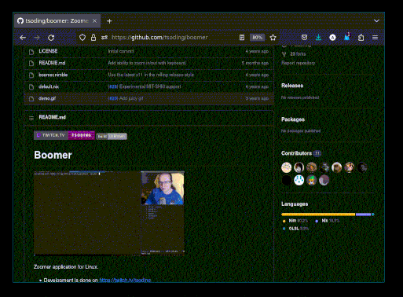

A tiny x11 mouse wheel zoomer inspired by Boomer (https://github.com/tsoding/boomer) and xbindkeys. After the program starts it's invisible (has no window), but uses `XGrabButton()` to intercept mouse wheel + Mod4 (Windows key) events, which triggers a screen shot you can zoom into. While zooming you can pan with WASD/arrows and LMB, and return to normal with [ESC] or the other mouse buttons.

